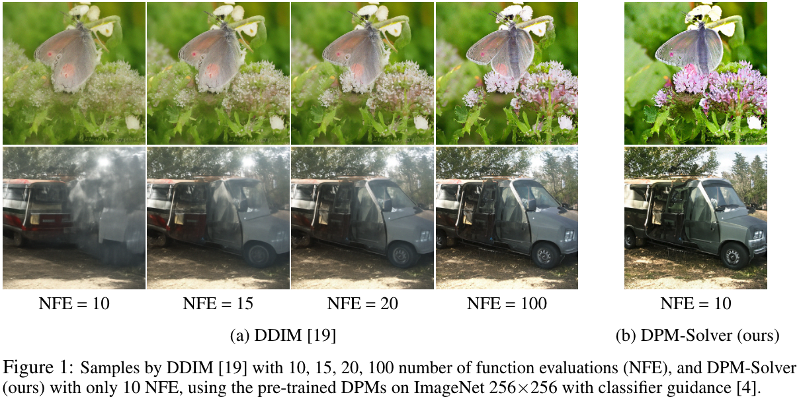
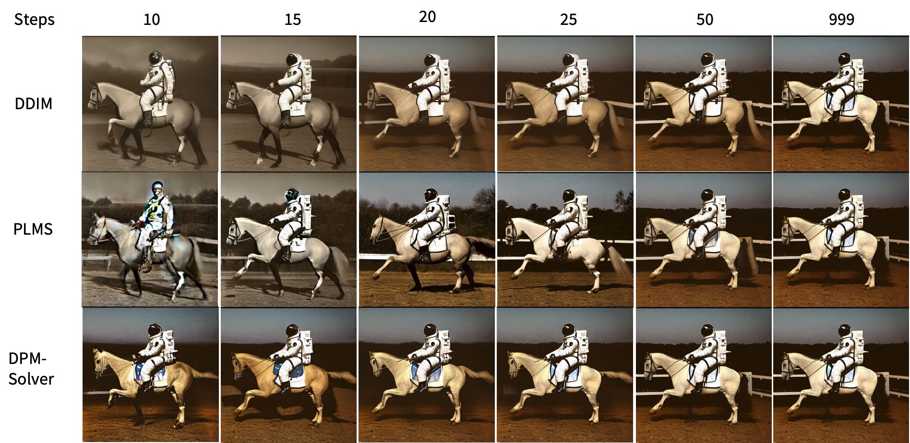
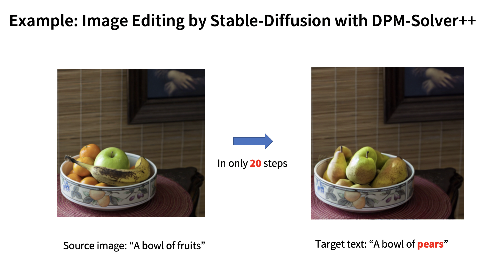

# DPM-Solver: A Fast ODE Solver for Diffusion Probabilistic Model Sampling in Around 10 Steps

The official code for the paper [DPM-Solver: A Fast ODE Solver for Diffusion Probabilistic Model Sampling in Around 10 Steps](https://arxiv.org/abs/2206.00927) (**Neurips 2022 Oral**) and [DPM-Solver++: Fast Solver for Guided Sampling of Diffusion Probabilistic Models](https://arxiv.org/abs/2211.01095) by Cheng Lu, Yuhao Zhou, Fan Bao, Jianfei Chen, Chongxuan Li and Jun Zhu.

--------------------

An [online demo](https://huggingface.co/spaces/LuChengTHU/dpmsolver_sdm) for DPM-Solver with stable-diffusion. Many thanks for the help and hardware resource supporting by HuggingFace 🤗.

--------------------

DPM-Solver (and the improved version DPM-Solver++) is a fast dedicated high-order solver for diffusion ODEs with the convergence order guarantee. DPM-Solver is suitable for both discrete-time and continuous-time diffusion models **without any further training**. Experimental results show that DPM-Solver can generate high-quality samples in **only 10 to 20** function evaluations on various datasets.

[ADM](https://arxiv.org/abs/2105.05233) with DPM-Solver:



[Stable-Diffusion](https://github.com/CompVis/stable-diffusion) with DPM-Solver++:



[DiffEdit](https://arxiv.org/abs/2210.11427) with DPM-Solver++:



<br />

- [News](#news)
- [Supported Models and Algorithms](#supported-models-and-algorithms)
- [Code Examples](#code-examples)
  * [Stable-Diffusion with DPM-Solver](#stable-diffusion-with-dpm-solver)
  * [ScoreSDE with DPM-Solver](#scoresde-with-dpm-solver)
  * [Other Examples](#other-examples)
- [Use DPM-Solver in your own code](#use-dpm-solver-in-your-own-code)
  * [Suggestions for Choosing the Hyperparameters](#suggestions-for-choosing-the-hyperparameters)
  * [Suggestions for the Detailed Settings](#suggestions-for-the-detailed-settings)
    + [Example: Unconditional Sampling by DPM-Solver](#example--unconditional-sampling-by-dpm-solver)
    + [Example: Classifier Guidance Sampling by DPM-Solver](#example--classifier-guidance-sampling-by-dpm-solver)
    + [Example: Classifier-Free Guidance Sampling by DPM-Solver](#example--classifier-free-guidance-sampling-by-dpm-solver)
- [Documentation](#documentation)
  * [1. Define the noise schedule.](#1-define-the-noise-schedule)
  * [2. Wrap your model to a continuous-time noise predicition model.](#2-wrap-your-model-to-a-continuous-time-noise-predicition-model)
  * [3. Define DPM-Solver](#3-define-dpm-solver)
- [TODO List](#todo-list)
- [References](#references)

# News
- DPM-Solver has been used in:
    * [DreamStudio](https://beta.dreamstudio.ai/home) and [StableBoost](https://stableboost.ai/) (thanks for the implementations by [Katherine Crowson's k-diffusion repo](https://github.com/crowsonkb/k-diffusion)).
    * [Stable-Diffusion-WebUI](https://github.com/AUTOMATIC1111/stable-diffusion-webui), which supports both DPM-Solver and DPM-Solver++. DPM-Solver++2M is the fastest solver currently. Also many Thanks to [Katherine Crowson's k-diffusion repo](https://github.com/crowsonkb/k-diffusion).
    * [Diffusers](https://github.com/huggingface/diffusers), a widely-used library for diffusion models.
    * [Stable-Diffusion v2 Official Code](https://github.com/Stability-AI/stablediffusion) and [Stable-Diffusion v1 Official Code](https://github.com/CompVis/stable-diffusion). Check [this pull request](https://github.com/CompVis/stable-diffusion/pull/440).
    * [Stable-Diffusion v2.0 Online Demo](https://huggingface.co/spaces/stabilityai/stable-diffusion) and [Stable-Diffusion v1.5 Online Demo](https://huggingface.co/spaces/runwayml/stable-diffusion-v1-5) on HuggingFace, which uses DPM-Solver in [Diffusers](https://github.com/huggingface/diffusers).

- **2022-11-11**. The [official demo of stable-diffusion](https://huggingface.co/spaces/runwayml/stable-diffusion-v1-5) in HuggingFace Spaces 🤗 uses DPM-Solver and runs twice as fast! (From 50 steps to 25 steps.) It can generate 8 images within **only 4 seconds** using JAX on TPUv2-8. Check [this twitter](https://twitter.com/pcuenq/status/1590665645233881089).

- **2022-11-08**. We provide an [online demo](https://huggingface.co/spaces/LuChengTHU/dpmsolver_sdm) for DPM-Solver with stable-diffusion. Many thanks for the help and harware resource support by HuggingFace 🤗!

- **2022-11-07**. Happy to announce that the multistep DPM-Solver has been supported by [diffusers](https://github.com/huggingface/diffusers)! Thanks for all the efforts of huggingface team (and me ^_^). Check [this PR](https://github.com/huggingface/diffusers/pull/1132) for details.

- **2022-10-26**. We have updated the **DPM-Solver v2.0**, a more stable version for high-resolutional image synthesis tasks. We have the following upgrades:
    - We support the discrete-time DPMs by implementing a picewise linear interpolation of $\log\alpha_t$ for the `NoiseScheduleVP`.
    
        We strongly recommend to use the new implementation for discrete-time DPMs, especially for high-resolutional image synthesis. You can set `schedule='discrete'` to use the corresponding noise schedule. We also change the mapping between discrete-time inputs and continuous-time inputs in the `model_wrapper`, which has a consistent converged results with the other solvers.
    - We change the API for `model_wrapper`:
      - We support four types of diffusion models: noise prediction model, data prediction model, velocity prediction model, score function.
      - We support unconditional sampling, classifier guidance sampling and classifier-free guidance sampling.
    - We support **new algorithms** for DPM-Solver, which greatly improve the high-resolutional image sample quality by guided sampling.
        - We support both [DPM-Solver](https://arxiv.org/abs/2206.00927) and [DPM-Solver++](https://arxiv.org/abs/2211.01095). For DPM-Solver++, we further support the *dynamic thresholding* introduced by [Imagen](https://arxiv.org/abs/2205.11487).
        - We support both *singlestep* solver (i.e. Runge-Kutta-like solver) and *multistep* solver (i.e. Adams-Bashforth-like solver) for DPM-Solver, including order 1, 2, 3.

<br />

# Supported Models and Algorithms
## Models
We support the following four types of diffusion models. You can set the model type by the argument `model_type` in the function `model_wrapper`.

| Model Type                                        | Training Objective                                           | Example Paper                                                      |
| ------------------------------------------------- | ------------------------------------------------------------ | ------------------------------------------------------------ |
| "noise": noise prediction model $\epsilon_\theta$ | $E_{x_{0},\epsilon,t}\left[\omega_1(t)\|\|\epsilon_\theta(x_t,t)-\epsilon\|\|_2^2\right]$ | [DDPM](https://arxiv.org/abs/2006.11239), [Stable-Diffusion](https://github.com/CompVis/stable-diffusion) |
| "x_start": data prediction model $x_\theta$       | $E_{x_0,\epsilon,t}\left[\omega_2(t)\|\|x_\theta(x_t,t)-x_0\|\|_2^2\right]$ | [DALL·E 2](https://arxiv.org/abs/2204.06125)                 |
| "v": velocity prediction model $v_\theta$         | $E_{x_0,\epsilon,t}\left[\omega_3(t)\|\|v_\theta(x_t,t)-(\alpha_t\epsilon - \sigma_t x_0)\|\|_2^2\right]$ | [Imagen Video](https://arxiv.org/abs/2210.02303)             |
| "score": marginal score function $s_\theta$       | $E_{x_0,\epsilon,t}\left[\omega_4(t)\|\|\sigma_t s_\theta(x_t,t)+\epsilon\|\|_2^2\right]$ | [ScoreSDE](https://arxiv.org/abs/2011.13456)                 |

## Sampling Types
We support the following three types of sampling by diffusion models. You can set the argument `guidance_type` in the function `model_wrapper`.


| Sampling Type                               | Equation for Noise Prediction Model                          | Example Paper                                                      |
| ------------------------------------------- | ------------------------------------------------------------ | ------------------------------------------------------------ |
| "uncond": unconditional sampling            | $\tilde\epsilon_\theta(x_t,t)=\epsilon_\theta(x_t,t)$        | [DDPM](https://arxiv.org/abs/2006.11239)                     |
| "classifier": classifier guidance           | $\tilde\epsilon_\theta(x_t,t,c)=\epsilon_\theta(x_t,t)-s\cdot\sigma_t\nabla_{x_t}\log q_\phi(x_t,t,c)$ | [ADM](https://arxiv.org/abs/2105.05233), [GLIDE](https://arxiv.org/abs/2112.10741) |
| "classifier-free": classifier-free guidance | $\tilde\epsilon_\theta(x_t,t,c)=s\cdot \epsilon_\theta(x_t,t,c)+(1-s)\cdot\epsilon_\theta(x_t,t)$ | [DALL·E 2](https://arxiv.org/abs/2204.06125), [Imagen](https://arxiv.org/abs/2205.11487), [Stable-Diffusion](https://github.com/CompVis/stable-diffusion) |


## Algorithms in DPM-Solver
We support the following four algorithms. The algorithms are [DPM-Solver](https://arxiv.org/abs/2206.00927) and [DPM-Solver++](https://arxiv.org/abs/2211.01095).

We also support the *dynamic thresholding* introduced by [Imagen](https://arxiv.org/abs/2205.11487) for algorithms with data-prediction. The dynamic thresholding method can further improve the sample quality by pixel-space DPMs with large guidance scales.

Note that the `model_fn` for initializing DPM-Solver is always the noise prediction model. The setting for `algorithm_type` is for the algorithm (DPM-Solver or DPM-Solver++), not for the model. In other words, both DPM-Solver and DPM-Solver++ is suitable for all the four model types.

- In fact, we implement the algorithms of DPM-Solver++ by firstly converting the noise prediction model to the data prediction model and then use DPM-Solver++ to sample, and users do not need to care about it.

The performance of singlestep solvers (i.e. Runge-Kutta-like solvers) and the multistep solvers (i.e.  Adams-Bashforth-like solvers) are different. We recommend to use different solvers for different tasks.

| Method                        | Supported Orders | Supporting Thresholding | Remark                                                      |
| ----------------------------- | ---------------- | -------------------- | ----------------------------------------------------------- |
| DPM-Solver, singlestep | 1, 2, 3          | No                   | Recommended for **unconditional sampling** (with order = 3). See [this paper](https://arxiv.org/abs/2206.00927). |
| DPM-Solver, multistep  | 1, 2, 3          | No                   |                                                             |
| DPM-Solver++, singlestep        | 1, 2, 3          | Yes                  | Recommended for **unconditional sampling** (with order = 3). See [this paper](https://arxiv.org/abs/2211.01095).                                                            |
| DPM-Solver++, multistep         | 1, 2, 3          | Yes                  | Recommended for **guided sampling** (with order = 2). See [this paper](https://arxiv.org/abs/2211.01095).        |

<br />

# Code Examples
## Text-to-Image by Stable-Diffusion with DPM-Solver
We provide an [example of stable diffusion with DPM-Solver](https://github.com/LuChengTHU/dpm-solver/tree/main/example_v2/stable-diffusion) in `example_v2/stable-diffusion`. DPM-Solver can greatly accelerate the sampling speed of the [original stable-diffusion](https://github.com/CompVis/stable-diffusion).

## Image Editing (DiffEdit) by Stable-Diffusion with DPM-Solver
We provide an [example of DiffEdit with DPM-Solver](https://github.com/LuChengTHU/dpm-solver/tree/main/example_v2/stable-diffusion), which can be used for image editing. The idea of [DiffEdit](https://arxiv.org/abs/2210.11427) can be general decribe as, using DDIM to get a 
invertable latent serise, then apply different prompt for inpainting (controled by auto generated mask). 

We could easily accelerate such editing / inpainting by DPM-Solver **in only 20 steps**.


## ScoreSDE with DPM-Solver
We provide a [pytorch example](https://github.com/LuChengTHU/dpm-solver/tree/main/example_v2/score_sde_pytorch) and a [JAX example](https://github.com/LuChengTHU/dpm-solver/tree/main/example_v2/score_sde_jax) in `example_v2/` which apply DPM-Solver for [Yang Song's score_sde repo](https://github.com/yang-song/score_sde) on CIFAR-10.


## Other Examples
Coming soon...

<br />

# Use DPM-Solver in your own code
It is very easy to combine DPM-Solver with your own diffusion models. We support both Pytorch and JAX code. You can just copy the file `dpm_solver_pytorch.py` or `dpm_solver_jax.py` to your own code files and import it.

In each step, DPM-Solver needs to compute the corresponding $\alpha_t$, $\sigma_t$ and $\lambda_t$ of the noise schedule. We support the commonly-used variance preserving (VP) noise schedule for both discrete-time and continuous-time DPMs:

- For discrete-time DPMs, we support a picewise linear interpolation of $\log\alpha_t$  in the `NoiseScheduleVP` class. It can support all types of VP noise schedules.

- For continuous-time DPMs, we support both linear schedule (as used in [DDPM](https://arxiv.org/abs/2006.11239) and [ScoreSDE](https://arxiv.org/abs/2011.13456)) and cosine schedule (as used in [improved-DDPM](https://arxiv.org/abs/2102.09672)) in the `NoiseScheduleVP` class.

Moreover, DPM-Solver is designed for the continuous-time diffusion ODEs. For discrete-time diffusion models, we also implement a wrapper function to convert the discrete-time diffusion models to the continuous-time diffusion models in the `model_wrapper` function.

<br />

## Suggestions for Choosing the Hyperparameters
If you want to find the best setting for accelerating the sampling procedure by your own diffusion models, we provide a reference guide here:

1. **IMPORTANT**: First run 1000-step [DDIM](https://arxiv.org/abs/2010.02502) to check the sample quality of your model. **If the sample quality is poor, then DPM-Solver cannot improve it.** Please further check your model defination or training process.
   
   Reason: DDIM is the first-order special case of DPM-Solver (proved in [our paper](https://arxiv.org/abs/2206.00927)). So given the same noise sample at time $T$, the converged samples of DDIM and DPM-Solver are the same. DPM-Solver **can** accelerate the convergence, but **cannot** improve the converged sample quality.

2. If 1000-step DDIM can generate quite good samples, then DPM-Solver can achieve a quite good sample quality within very few steps because it can greatly accelerate the convergence. You may want to further choose the detailed hyperparameters of DPM-Solver. Here we provide a comprehensive searching routine:

    - Comparing `algorithm_type="dpmsolver"` and `algorithm_type="dpmsolver++"`. Note that these settings are for the algorithm, not for the model. In other words, even for `algorithm_type="dpmsolver++`, you can still use the noise prediction model (such as stable-diffusion) and the algorithm can work well.

    - (Optional) Comparing with / without dynamic thresholding.
    
      **IMPORTANT**: our supported dynamic thresholding method is only valid for **pixel-space** diffusion models with `algorithm_type="dpmsolver++`. For example, [Imagen](https://arxiv.org/abs/2205.11487) uses the dynamic thresholding method and greatly improves the sample quality. The thresholding method pushes the pixel-space samples into the bounded area, so it can generate reasonable images. However, for latent-space diffusion models (such as stable-diffusion), the thresholding method is **unsuitable** because the $x_0$ at time $0$ of the diffusion model is in fact the "latent variable" in the latent space and it is unbounded.

    - Comparing `singlestep` or `multistep` methods.

    - Comparing `order = 2, 3`. Note that the all the first-order versions are equivalent to DDIM, so you do not need to try it.

    - Comparing `steps = 10, 15, 20, 25, 50, 100`. It depends on your computation resources and the need of sample quality.

    - (Optional) Comparing the `time_uniform`, `logSNR` and `time_quadratic` for the skip type.

        We empirically find that for high-resolutional images, the best setting is the `time_uniform`. So we recommend this setting and there is no need for extra searching. However, for low-resolutional images such as CIFAR-10, we empirically find that `logSNR` is the best setting.

    - (Optional) Comparing `denoise_to_zero=True` or `denoise_to_zero=False`.
  
        Empirically, the `denoise_to_zero=True` can improve the FID for low-resolutional images such as CIFAR-10. However, the influence of this method for high-resolutional images seem to be small. As the denoise_to_zero method needs one additional function evaluation (i.e. one additional step), we do not recommend to use the denoise_to_zero method for high-resolutional images.

    The detailed pseudo code is like:

    ```python
    for algorithm_type in ["dpmsolver", "dpmsolver++"]:
    # Optional, for correcting_x0_fn in [None, "dynamic_thresholding"]:
        dpm_solver = DPM_Solver(..., algorithm_type=algorithm_type) # ... means other arguments
        for method in ['singlestep', 'multistep']:
            for order in [2, 3]:
                for steps in [10, 15, 20, 25, 50, 100]:
                    sample = dpm_solver.sample(
                        ..., # ... means other arguments
                        method=method,
                        order=order,
                        steps=steps,
                        # optional: skip_type='time_uniform' or 'logSNR' or 'time_quadratic',
                        # optional: denoise_to_zero=True or False
                    )

    ```

    And then compare the samples to choose the best setting.

Moreover, for unconditional sampling and guided sampling, we have some recommendation settings and code examples, which are listed in the following section.

<br />

## Suggestions for the Detailed Settings
We recommend to use the following two types of solvers for different tasks:

- 3rd-order singlestep DPM-Solver:
    ```python
    ## Define the model and noise schedule (see examples below) 
    ## ....

    ## Define DPM-Solver and compute the sample.
    dpm_solver = DPM_Solver(model_fn, noise_schedule, algorithm_type="dpmsolver++")
    ## Or also try:
    ## dpm_solver = DPM_Solver(model_fn, noise_schedule, algorithm_type="dpmsolver")

    ## Steps in [10, 20] can generate quite good samples.
    ## And steps = 20 can almost converge.
    x_sample = dpm_solver.sample(
        x_T,
        steps=20,
        order=3,
        skip_type="time_uniform",
        method="singlestep",
    )
    ```

- 2nd-order multistep DPM-Solver:
    - For general DPMs (e.g. latent-space DPMs):
        ```python
        ## Define the model and noise schedule (see examples below) 
        ## ....

        ## Define DPM-Solver and compute the sample.
        dpm_solver = DPM_Solver(model_fn, noise_schedule, algorithm_type="dpmsolver++")

        ## Steps in [10, 20] can generate quite good samples.
        ## And steps = 20 can almost converge.
        x_sample = dpm_solver.sample(
            x_T,
            steps=20,
            order=2,
            skip_type="time_uniform",
            method="multistep",
        )
        ```
    - For DPMs trained on bounded data (e.g. pixel-space images), we further support the *dynamic thresholding* method introduced by [Imagen](https://arxiv.org/abs/2205.11487) by setting `correcting_x0_fn = "dynamic_thresholding"`. The dynamic thresholding method can greatly improve the sample quality of pixel-space DPMs by guided sampling with large guidance scales.
        ```python
        ## Define the model and noise schedule (see examples below) 
        ## ....

        ## Define DPM-Solver and compute the sample.
        dpm_solver = DPM_Solver(model_fn, noise_schedule, algorithm_type="dpmsolver++",
                                correcting_x0_fn="dynamic_thresholding")

        ## Steps in [10, 20] can generate quite good samples.
        ## And steps = 20 can almost converge.
        x_sample = dpm_solver.sample(
            x_T,
            steps=20,
            order=2,
            skip_type="time_uniform",
            method="multistep",
        )
        ```

Specifically, we have the following suggestions:

- For unconditional sampling:
  - For obtaining a not too bad sample as fast as possible, use the 2nd-order (dpmsolver++, multistep) DPM-Solver with `steps` <= 10. 
  - For obtaining a good sample, use the 3rd-order (dpmsolver or dpmsolver++, singlestep) DPM-Solver with `steps` = 15.
  - **(Recommended)** For obtaining an almost converged sample, use the 3rd-order (dpmsolver or dpmsolver++, singlestep) DPM-Solver with `steps` = 20.
  - For obtaining an absolutely converged sample, use the 3rd-order (dpmsolver or dpmsolver++, singlestep) DPM-Solver with `steps` = 50.

- For guided sampling (especially with large guidance scales):
  - Use the 2nd-order (dpmsolver++, multistep) DPM-Solver for all steps.
  - For pixel-space DPMs (i.e. DPMs trained on images), set `correcting_x0_fn="dynamic_thresholding"`; else (e.g. latent-space DPMs) set `correcting_x0_fn=None`.
  - Choices for `steps`:
    - For obtaining a not too bad sample as fast as possible, use `steps` <= 10. 
    - For obtaining a good sample, use `steps` = 15.
    - **(Recommended)** For obtaining an almost converged sample, use `steps` = 20.
    - For obtaining an absolutely converged sample, use `steps` = 50.

<br />

## Example: Unconditional Sampling by DPM-Solver
We recommend to use the 3rd-order (dpmsolver or dpmsolver++, singlestep) DPM-Solver. Here is an example for discrete-time DPMs:

```python
from dpm_solver_pytorch import NoiseScheduleVP, model_wrapper, DPM_Solver

## You need to firstly define your model and the extra inputs of your model,
## And initialize an `x_T` from the standard normal distribution.
## `model` has the format: model(x_t, t_input, **model_kwargs).
## If your model has no extra inputs, just let model_kwargs = {}.

## If you use discrete-time DPMs, you need to further define the
## beta arrays for the noise schedule.

# model = ....
# model_kwargs = {...}
# x_T = ...
# betas = ....

## 1. Define the noise schedule.
noise_schedule = NoiseScheduleVP(schedule='discrete', betas=betas)

## 2. Convert your discrete-time `model` to the continuous-time
## noise prediction model. Here is an example for a diffusion model
## `model` with the noise prediction type ("noise") .
model_fn = model_wrapper(
    model,
    noise_schedule,
    model_type="noise",  # or "x_start" or "v" or "score"
    model_kwargs=model_kwargs,
)

## 3. Define dpm-solver and sample by singlestep DPM-Solver.
## (We recommend singlestep DPM-Solver for unconditional sampling)
## You can adjust the `steps` to balance the computation
## costs and the sample quality.
dpm_solver = DPM_Solver(model_fn, noise_schedule, algorithm_type="dpmsolver")
## Can also try
# dpm_solver = DPM_Solver(model_fn, noise_schedule, algorithm_type="dpmsolver++")

## You can use steps = 10, 12, 15, 20, 25, 50, 100.
## Empirically, we find that steps in [10, 20] can generate quite good samples.
## And steps = 20 can almost converge.
x_sample = dpm_solver.sample(
    x_T,
    steps=20,
    order=3,
    skip_type="time_uniform",
    method="singlestep",
)
```

<br />

## Example: Classifier Guidance Sampling by DPM-Solver
We recommend to use the 2nd-order (dpmsolver++, multistep) DPM-Solver, especially for large guidance scales. Here is an example for discrete-time DPMs:

```python
from dpm_solver_pytorch import NoiseScheduleVP, model_wrapper, DPM_Solver

## You need to firstly define your model and the extra inputs of your model,
## And initialize an `x_T` from the standard normal distribution.
## `model` has the format: model(x_t, t_input, **model_kwargs).
## If your model has no extra inputs, just let model_kwargs = {}.

## If you use discrete-time DPMs, you need to further define the
## beta arrays for the noise schedule.

## For classifier guidance, you need to further define a classifier function,
## a guidance scale and a condition variable.

# model = ....
# model_kwargs = {...}
# x_T = ...
# condition = ...
# betas = ....
# classifier = ...
# classifier_kwargs = {...}
# guidance_scale = ...

## 1. Define the noise schedule.
noise_schedule = NoiseScheduleVP(schedule='discrete', betas=betas)

## 2. Convert your discrete-time `model` to the continuous-time
## noise prediction model. Here is an example for a diffusion model
## `model` with the noise prediction type ("noise") .
model_fn = model_wrapper(
    model,
    noise_schedule,
    model_type="noise",  # or "x_start" or "v" or "score"
    model_kwargs=model_kwargs,
    guidance_type="classifier",
    condition=condition,
    guidance_scale=guidance_scale,
    classifier_fn=classifier,
    classifier_kwargs=classifier_kwargs,
)

## 3. Define dpm-solver and sample by multistep DPM-Solver.
## (We recommend multistep DPM-Solver for conditional sampling)
## You can adjust the `steps` to balance the computation
## costs and the sample quality.

dpm_solver = DPM_Solver(model_fn, noise_schedule, algorithm_type="dpmsolver++")

## If the DPM is defined on pixel-space images, you can further
## set `correcting_x0_fn="dynamic_thresholding"`. e.g.:

# dpm_solver = DPM_Solver(model_fn, noise_schedule, algorithm_type="dpmsolver++",
#   correcting_x0_fn="dynamic_thresholding")


## You can use steps = 10, 12, 15, 20, 25, 50, 100.
## Empirically, we find that steps in [10, 20] can generate quite good samples.
## And steps = 20 can almost converge.
x_sample = dpm_solver.sample(
    x_T,
    steps=20,
    order=2,
    skip_type="time_uniform",
    method="multistep",
)
```

## Example: Classifier-Free Guidance Sampling by DPM-Solver
We recommend to use the 2nd-order (dpmsolver++, multistep) DPM-Solver, especially for large guidance scales. Here is an example for discrete-time DPMs:

```python
from dpm_solver_pytorch import NoiseScheduleVP, model_wrapper, DPM_Solver

## You need to firstly define your model and the extra inputs of your model,
## And initialize an `x_T` from the standard normal distribution.
## `model` has the format: model(x_t, t_input, cond, **model_kwargs).
## If your model has no extra inputs, just let model_kwargs = {}.

## If you use discrete-time DPMs, you need to further define the
## beta arrays for the noise schedule.

## For classifier-free guidance, you need to further define a guidance scale,
## a condition variable and an unconditioanal condition variable.

# model = ....
# model_kwargs = {...}
# x_T = ...
# condition = ...
# unconditional_condition = ...
# betas = ....
# guidance_scale = ...

## 1. Define the noise schedule.
noise_schedule = NoiseScheduleVP(schedule='discrete', betas=betas)

## 2. Convert your discrete-time `model` to the continuous-time
## noise prediction model. Here is an example for a diffusion model
## `model` with the noise prediction type ("noise") .
model_fn = model_wrapper(
    model,
    noise_schedule,
    model_type="noise",  # or "x_start" or "v" or "score"
    model_kwargs=model_kwargs,
    guidance_type="classifier-free",
    condition=condition,
    unconditional_condition=unconditional_condition,
    guidance_scale=guidance_scale,
)

## 3. Define dpm-solver and sample by multistep DPM-Solver.
## (We recommend multistep DPM-Solver for conditional sampling)
## You can adjust the `steps` to balance the computation
## costs and the sample quality.

dpm_solver = DPM_Solver(model_fn, noise_schedule, algorithm_type="dpmsolver++")

## If the DPM is defined on pixel-space images, you can further
## set `correcting_x0_fn="dynamic_thresholding"`. e.g.:

# dpm_solver = DPM_Solver(model_fn, noise_schedule, algorithm_type="dpmsolver++",
#   correcting_x0_fn="dynamic_thresholding")


## You can use steps = 10, 12, 15, 20, 25, 50, 100.
## Empirically, we find that steps in [10, 20] can generate quite good samples.
## And steps = 20 can almost converge.
x_sample = dpm_solver.sample(
    x_T,
    steps=20,
    order=2,
    skip_type="time_uniform",
    method="multistep",
)
```


<br />

# Documentation

## 1. Define the noise schedule.
We support the commonly-used variance preserving (VP) noise schedule for both discrete-time and continuous-time DPMs:

### 1.1. Discrete-time DPMs
We support a picewise linear interpolation of $\log\alpha_{t}$  in the `NoiseScheduleVP` class. It can support all types of VP noise schedules.
  
We need either the $\beta_i$ array or the $\bar{\alpha}_i$ array (see [DDPM](https://arxiv.org/abs/2006.11239) for details) to define the noise schedule. Note that the $\bar{\alpha}_i$ in [DDPM](https://arxiv.org/abs/2006.11239) is different from the $\alpha_t$ in DPM-Solver, and the detailed relationship is:

$$ \bar{\alpha}_i = \prod (1 - \beta_k) $$

$$ \alpha_{t_i} = \sqrt{\bar{\alpha}_i} $$

Define the discrete-time noise schedule by the $\beta_i$ array:
```python
noise_schedule = NoiseScheduleVP(schedule='discrete', betas=betas)
```

Or define the discrete-time noise schedule by the $\bar{\alpha}_i$ array:
```python
noise_schedule = NoiseScheduleVP(schedule='discrete', alphas_cumprod=alphas_cumprod)
```

<br />

### 1.2. Continuous-time DPMs
We support both linear schedule (as used in [DDPM](https://arxiv.org/abs/2006.11239) and [ScoreSDE](https://arxiv.org/abs/2011.13456)) and cosine schedule (as used in [improved-DDPM](https://arxiv.org/abs/2102.09672)) for the continuous-time DPMs.

Define the continuous-time linear noise schedule:
```python
noise_schedule = NoiseScheduleVP(schedule='linear', continuous_beta_0=0.1, continuous_beta_1=20.)
```

Define the continuous-time cosine noise schedule:
```python
noise_schedule = NoiseScheduleVP(schedule='cosine')
```

<!-- 
If you want to custom your own designed noise schedule, you need to implement the `marginal_log_mean_coeff`, `marginal_std`, `marginal_lambda` and `inverse_lambda` functions of your noise schedule. Please refer to the detailed comments in the code of `NoiseScheduleVP`.
 -->

<br />

## 2. Wrap your model to a continuous-time noise predicition model.

For a given diffusion `model` with an input of the time label
(may be discrete-time labels (i.e. 0 to 999) or continuous-time times (i.e. 0 to 1)), and the output type of the model may be "noise" or "x_start" or "v" or "score", we wrap the model function to the following format:
```python
model_fn(x, t_continuous) -> noise
```

where `t_continuous` is the continuous time labels (i.e. 0 to 1), and the output type of the model is "noise", i.e. a noise prediction model. And we use the continuous-time noise prediction model `model_fn` for DPM-Solver.

Note that DPM-Solver only needs the noise prediction model (the $\epsilon_\theta(x_t, t)$ model, also as known as the "mean" model), so for diffusion models which predict both "mean" and "variance" (such as [improved-DDPM](https://arxiv.org/abs/2102.09672)), you need to firstly define another function by yourself to only output the "mean".

<br />

### 2.1. Sampling without Guidance
After defining the noise schedule, we need to further wrap the `model` to a continuous-time noise prediction model. The given `model` has the following format:
```python
model(x_t, t_input, **model_kwargs) -> noise | x_start | v | score
```

And we wrap the model by:

```python
model_fn = model_wrapper(
    model,
    noise_schedule,
    model_type=model_type, # "noise" or "x_start" or "v" or "score"
    model_kwargs=model_kwargs,
)
```
where `model_kwargs` is the additional inputs of the model, and the `model_type` can be "noise" or "x_start" or "v" or "score".

<br />

### 2.2. Sampling with Classifier Guidance
After defining the noise schedule, we need to further wrap the `model` to a continuous-time noise prediction model. The given `model` has the following format:
```python
model(x_t, t_input, **model_kwargs) -> noise | x_start | v | score
```
For DPMs with classifier guidance, we also combine the model output with the classifier gradient. We need to specify the classifier function and the guidance scale. The classifier function has the following format:
```python
classifier_fn(x, t_input, cond, **classifier_kwargs) -> logits(x, t_input, cond)
```
where `t_input` is the same time label as in the original diffusion model `model`, and `cond` is the condition variable, and `classifier_kwargs` is the other inputs of the classifier function.

And we wrap the model by:

```python
model_fn = model_wrapper(
    model,
    noise_schedule,
    model_type=model_type,  # "noise" or "x_start" or "v" or "score"
    model_kwargs=model_kwargs,
    guidance_type="classifier",
    condition=condition,
    guidance_scale=guidance_scale,
    classifier_fn=classifier,
    classifier_kwargs=classifier_kwargs,
)
```
where `model_kwargs` is the additional inputs of the model, and the `model_type` can be "noise" or "x_start" or "v" or "score", and `guidance_scale` is the classifier guidance scale, and `condition` is the conditional input of the classifier.

<br />

### 2.3. Sampling with Classifier-free Guidance
After defining the noise schedule, we need to further wrap the `model` to a continuous-time noise prediction model. The given `model` has the following format:
```python
model(x_t, t_input, cond, **model_kwargs) -> noise | x_start | v | score
```
Note that for classifier-free guidance, the model needs another input `cond`. And if `cond` is a special variable `unconditional_condition`, the model output is the unconditional DPM output.

And we wrap the model by:

```python
model_fn = model_wrapper(
    model,
    noise_schedule,
    model_type=model_type,  # "noise" or "x_start" or "v" or "score"
    model_kwargs=model_kwargs,
    guidance_type="classifier-free",
    condition=condition,
    unconditional_condition=unconditional_condition,
    guidance_scale=guidance_scale,
)
```
where `model_kwargs` is the additional inputs of the model, and the `model_type` can be "noise" or "x_start" or "v" or "score", and `guidance_scale` is the classifier guidance scale, and `condition` is the conditional input, and `unconditional_condition` is the special unconditional condition variable for the unconditional model.

<br />

### 2.4. Implementation Details for the Time Inputs
Below we introduce the detailed mapping between the discrete-time labels and the continuous-time times. However, to use DPM-Solver, it is not necessary to understand the following details. 

#### Discrete-time DPM-Solver
For discrete-time DPMs, the noise prediction model noise-prediction is trained for the discrete-time labels from $0$ to $N-1$. Therefore, we sample from the discrete-time label $N - 1$ (e.g. 999) to the discrete-time label $0$. We convert the discrete-time labels in $[0, N-1]$ to the continuous-time times $(0,1]$ by

$$
    t_{\text{discrete}} = 1000 * \left(t_{\text{continuous}} - \frac{1}{N}\right),
$$

i.e. we map the discrete-time label $0$ to the continuous-time time $\frac{1}{N}$, and the discrete-time label $N-1$ to the continuous-time time $1$. Therefore, sampling from the discrete time from $N-1$ to $0$ is corresponding to sampling from the continuous time from $1$ to $\frac{1}{N}$.

#### Continuous-time DPM-Solver
For continuous-time DPMs from defined by $t \in [0,1]$, we simply wrap the model to accept only $x_t$ and $t$. Note that for continuous-time DPMs, we do not modify the time inputs.

<br />


## 3. Define DPM-Solver
After defining the `model_fn` by the function `model_wrapper`, we can further use `model_fn` to define DPM-Solver and compute samples.

We support the following four algorithms. The algorithms are [DPM-Solver](https://arxiv.org/abs/2206.00927) and [DPM-Solver++](https://arxiv.org/abs/2211.01095).

We also support the *dynamic thresholding* introduced by [Imagen](https://arxiv.org/abs/2205.11487) for algorithms with data-prediction. The dynamic thresholding method can further improve the sample quality by pixel-space DPMs with large guidance scales.

Note that the `model_fn` for initializing DPM-Solver is always the noise prediction model. The setting for `algorithm_type` is for the algorithm (DPM-Solver or DPM-Solver++), not for the model. In other words, both DPM-Solver and DPM-Solver++ is suitable for all the four model types.

- In fact, we implement the algorithms of DPM-Solver++ by firstly converting the noise prediction model to the data prediction model and then use DPM-Solver++ to sample, and users do not need to care about it.

The performance of singlestep solvers (i.e. Runge-Kutta-like solvers) and the multistep solvers (i.e.  Adams-Bashforth-like solvers) are different. We recommend to use different solvers for different tasks.

| Method                        | Supported Orders | Supporting Thresholding | Remark                                                      |
| ----------------------------- | ---------------- | -------------------- | ----------------------------------------------------------- |
| DPM-Solver, singlestep | 1, 2, 3          | No                   | Recommended for **unconditional sampling** (with order = 3). See [this paper](https://arxiv.org/abs/2206.00927). |
| DPM-Solver, multistep  | 1, 2, 3          | No                   |                                                             |
| DPM-Solver++, singlestep        | 1, 2, 3          | Yes                  | Recommended for **unconditional sampling** (with order = 3). See [this paper](https://arxiv.org/abs/2211.01095).                                                            |
| DPM-Solver++, multistep         | 1, 2, 3          | Yes                  | Recommended for **guided sampling** (with order = 2). See [this paper](https://arxiv.org/abs/2211.01095).        |


- For DPM-Solver with "dpmsolver" algorithm, define
    ```python
    dpm_solver = DPM_Solver(model_fn, noise_schedule, algorithm_type="dpmsolver")
    ```

- For DPM-Solver with "dpmsolver++" algorithm, define
    ```python
    dpm_solver = DPM_Solver(model_fn, noise_schedule, algorithm_type="dpmsolver++")
    ```

- For DPM-Solver with "dpmsolver++" and applying dynamic thresholding, define
    ```python
    dpm_solver = DPM_Solver(model_fn, noise_schedule, algorithm_type="dpmsolver++",
                            correcting_x0_fn="dynamic_thresholding", thresholding_max_val=1.0)
    ```

You can use `dpm_solver.sample` to quickly sample from DPMs. This function computes the ODE solution at time `t_end` by DPM-Solver, given the initial `x` at time `t_start`.

We support the following algorithms:
- Singlestep DPM-Solver. We combine all the singlestep solvers with order <= `order` to use up all the function evaluations (steps).

- Multistep DPM-Solver.

- Fixed order singlestep DPM-Solver (i.e. DPM-Solver-1, DPM-Solver-2 and DPM-Solver-3).

- Adaptive step size DPM-Solver. (i.e. DPM-Solver-12 and DPM-Solver-23)


We support three types of `skip_type` for the choice of intermediate time steps:

- `logSNR`: uniform logSNR for the time steps. **Recommended for low-resolutional images**.

- `time_uniform`: uniform time for the time steps. **Recommended for high-resolutional images**.

- `time_quadratic`: quadratic time for the time steps.


<br />

### 3.1. Sampling by Singlestep DPM-Solver

We combine all the singlestep solvers with order <= `order` to use up all the function evaluations (steps). The total number of function evaluations (NFE) == `steps`.

For discrete-time DPMs, we do not need to specify the `t_start` and `t_end`. The default setting is to sample from the discrete-time label $N-1$ to the discrete-time label $0$. For example,
```python
## discrete-time DPMs
x_sample = dpm_solver.sample(
    x_T,
    steps=20,
    order=3,
    skip_type="time_uniform",
    method="singlestep",
)
```

<br />

For continuous-time DPMs, we sample from `t_start=1.0` (the default setting) to `t_end`. We recommend `t_end=1e-3` for `steps <= 15`, and `t_end=1e-4` for `steps > 15`. For example:
```python
x_sample = dpm_solver.sample(
    x_T,
    t_end=1e-3,
    steps=12,
    order=3,
    skip_type="time_uniform",
    method="singlestep",
)
```
```python
## continuous-time DPMs
x_sample = dpm_solver.sample(
    x_T,
    t_end=1e-4,
    steps=20,
    order=3,
    skip_type="time_uniform",
    method="singlestep",
)
```

#### Implementation Details of Singlestep DPM-Solver

Given a fixed NFE == `steps`, the sampling procedure is:
- If `order` == 1:
    - Denote K = `steps`. We use K steps of DPM-Solver-1 (i.e. DDIM).
- If `order` == 2:
    - Denote K = (`steps` // 2) + (`steps` % 2). We take K intermediate time steps for sampling.
    - If `steps` % 2 == 0, we use K steps of singlestep DPM-Solver-2.
    - If `steps` % 2 == 1, we use (K - 1) steps of singlestep DPM-Solver-2 and 1 step of DPM-Solver-1.
- If `order` == 3:
    - Denote K = (`steps` // 3 + 1). We take K intermediate time steps for sampling.
    - If `steps` % 3 == 0, we use (K - 2) steps of singlestep DPM-Solver-3, and 1 step of singlestep DPM-Solver-2 and 1 step of DPM-Solver-1.
    - If `steps` % 3 == 1, we use (K - 1) steps of singlestep DPM-Solver-3 and 1 step of DPM-Solver-1.
    - If `steps` % 3 == 2, we use (K - 1) steps of singlestep DPM-Solver-3 and 1 step of singlestep DPM-Solver-2.


<br />

### 3.2. Sampling by multistep DPM-Solver
For discrete-time DPMs, we do not need to specify the `t_start` and `t_end`. The default setting is to sample from the discrete-time label $N-1$ to the discrete-time label $0$. For example,
```python
## discrete-time DPMs
x_sample = dpm_solver.sample(
    x_T,
    steps=20,
    order=2,
    skip_type="time_uniform",
    method="multistep",
)
```

<br />

For continuous-time DPMs, we sample from `t_start=1.0` (the default setting) to `t_end`. We recommend `t_end=1e-3` for `steps <= 15`, and `t_end=1e-4` for `steps > 15`. For example:
```python
x_sample = dpm_solver.sample(
    x_T,
    t_end=1e-3,
    steps=10,
    order=2,
    skip_type="time_uniform",
    method="multistep",
)
```
```python
## continuous-time DPMs
x_sample = dpm_solver.sample(
    x_T,
    t_end=1e-4,
    steps=20,
    order=3,
    skip_type="time_uniform",
    method="multistep",
)
```

#### Implementation Details of Multistep DPM-Solver
We initialize the first `order` values by lower order multistep solvers.

Given a fixed NFE == `steps`, the sampling procedure is:
- Denote K = `steps`.
- If `order` == 1:
    - We use K steps of DPM-Solver-1 (i.e. DDIM).
- If `order` == 2:
    - We firstly use 1 step of DPM-Solver-1, then use (K - 1) step of multistep DPM-Solver-2.
- If `order` == 3:
    - We firstly use 1 step of DPM-Solver-1, then 1 step of multistep DPM-Solver-2, then (K - 2) step of multistep DPM-Solver-3.


### 3.3. Sampling by adaptive step size DPM-Solver
For continuous-time DPMs, we recommend `t_end=1e-4` for better sample quality.

We ignore `steps` and use adaptive step size DPM-Solver with a higher order of `order`.
You can adjust the absolute tolerance `atol` and the relative tolerance `rtol` to balance the computatation costs (NFE) and the sample quality. For image data, we recommend `atol=0.0078` (the default setting).

- If `order` == 2, we use DPM-Solver-12 which combines DPM-Solver-1 and singlestep DPM-Solver-2.
- If `order` == 3, we use DPM-Solver-23 which combines singlestep DPM-Solver-2 and singlestep DPM-Solver-3.

For example, to sample by DPM-Solver-12:
```python
x_sample = dpm_solver.sample(
    x_T,
    t_end=1e-4,
    order=2,
    method="adaptive",
    rtol=0.05,
)
```

<br />

### 3.4. Sampling by Singlestep DPM-Solver-k for k = 1, 2, 3
We use DPM-Solver-`order` for `order` = 1 or 2 or 3, with total [`steps` // `order`] * `order` NFE.

For example, to sample by DPM-Solver-3:
```python
x_sample = dpm_solver.sample(
    x_T,
    steps=30,
    order=3,
    skip_type="time_uniform",
    method="singlestep_fixed",
)
```

<br />

# TODO List
- [x] Add stable-diffusion examples.
- [x] Support Diffusers.
- [ ] Documentation for example code.
- [x] Clean and add the JAX code example.
- [ ] Add more explanations about DPM-Solver.
- [ ] Add a small jupyter example. 
- [ ] Add VE type noise schedule.
- [ ] Support downstream applications (e.g. inpainting, etc.).


<br />

# References

If you find the code useful for your research, please consider citing
```bib
@article{lu2022dpm,
  title={DPM-Solver: A Fast ODE Solver for Diffusion Probabilistic Model Sampling in Around 10 Steps},
  author={Lu, Cheng and Zhou, Yuhao and Bao, Fan and Chen, Jianfei and Li, Chongxuan and Zhu, Jun},
  journal={arXiv preprint arXiv:2206.00927},
  year={2022}
}
```
